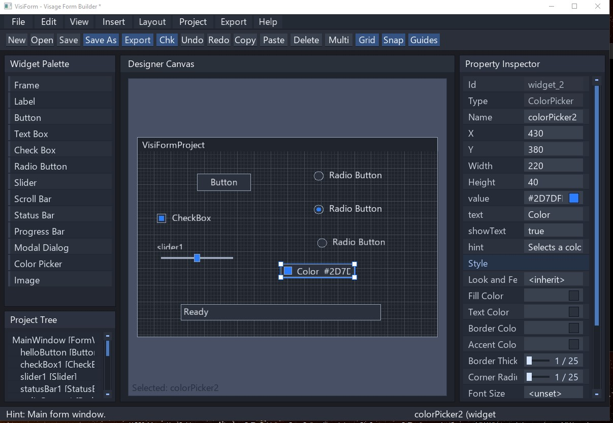

# VisiForm

*A C++ / Visage UI form builder that generates Visage-based C++ projects.*

Current version: `1.0.3`

Current development phase: Phase 97

## Screenshot

   

## What VisiForm does

`VisiForm` is a form builder inspired by tools like `wxFormBuilder`.
It uses the `Visage` graphics and UI library to let you design forms visually, save projects as `.vfb.json`, validate the in-memory project model, and export complete generated C++ projects.

Exported projects include:

- generated `MainWindow` base class files
- generated user subclass files
- `USER CODE BEGIN` / `USER CODE END` preservation blocks
- generated `CMakeLists.txt`, `CMakePresets.json`, and helper scripts
- optional local `Visage` source support with `FetchContent` fallback

## Platform status

| Platform | Status | Notes |
| --- | --- | --- |
| Windows 10/11 | Primary supported | Developed and tested with `Visual Studio 2022`. |
| macOS | Experimental/build instructions provided | Requires `Clang`, `CMake`, `Ninja`, `vcpkg`, `Visage` platform support, and additional native dialog work. |
| Linux | Experimental/build instructions provided | Requires `GCC` or `Clang`, `CMake`, `Ninja`, `vcpkg`, `Visage` platform support, and additional native dialog work. |

Windows is the primary tested platform.
macOS and Linux instructions are provided for contributors, but may require additional native dialog or platform package work.
These non-Windows build paths were not verified in this Windows agent environment, so this README should not be treated as a claim of full production support there.

## Current status

Current major features include:

- Widget Palette
- Designer Canvas
- Property Inspector
- Project Tree
- Resource Manager
- Menu bar
- Undo/Redo
- Customizable keyboard shortcuts
- Validation
- Modal dialogs
- GroupBox parenting and child editing
- TabControl and TabPage parenting/editing
- Image resource binding and preview support
- StatusBar insertion with default bottom docking in the editor
- Basic dock and anchor layout behavior for root form, `GroupBox`, and `TabPage` parents in the editor
- Optional BoxSizer-style `Sizer` support with vertical/horizontal child layout, side padding, gap, per-child proportion, expand, alignment, borders, minimum overrides, nested sizers, and fixed/stretch spacers
- `TreeView` widget support with visual node editing in the editor
- Shared rounded-corner boxed-widget rendering for `GroupBox`, `Panel`, `TextBox`, `ComboBox`, `ListBox`, `TreeView`, and `ProgressBar` previews
- `Project Tree` rows render widget name as primary text and widget type as secondary text
- Save/load `.vfb.json`
- Export generated C++ projects
- Interactive generated widgets
- Local `Visage` dependency support

Recent editor UI progress:

- top tabbed Widget Palette
- hierarchical Project Tree
- Project Tree hover hints and hierarchy fixes
- draggable splitter between the Project Tree and Designer Canvas

Recent `TreeView` and inspector usability updates:

- inspector-owned dropdowns now collapse immediately when the `Property Inspector` scrolls
- the `TreeView` `Nodes` editor now opens a visual tree editor instead of a raw indentation-only text box
- the visual editor supports selecting a node, renaming it through a field, adding child or sibling nodes, removing nodes, and moving nodes up or down among siblings
- `Apply` writes the edited hierarchy back into the existing `nodes`, `selectedNodePath`, and `expandedNodePaths` properties used by save/load, validation, preview, and export

## Current layout support

The editor currently supports a first formal pass of parent-relative docking and anchoring behavior.

Supported editor layout behavior:

- `Dock`: `None`, `Top`, `Bottom`, `Left`, `Right`, `Fill`
- readable `Anchor` presets in the Property Inspector
- automatic relayout when supported parents resize
- parent-relative child layout inside the root form, `GroupBox`, `TabPage`, and `Sizer`
- `StatusBar` defaults to `Dock = Bottom` and fills parent width in the editor

Current scope notes:

- `Dock` takes priority over `Anchor`
- `GroupBox` and `TabControl` editing workflows remain supported
- save/load preserves layout metadata through project properties
- validation checks invalid `dock` and `anchor` values
- exported/runtime dock and anchor behavior is still more limited than the editor and will continue to expand in follow-up work

## Core build requirements

- `CMake 3.24` or newer
- `Ninja`
- `Git`
- `vcpkg`
- local `Visage` source checkout recommended for faster iteration
- C++20-capable compiler toolchain

Current repository dependencies from `vcpkg.json` include:

- `nlohmann-json`
- `fmt`
- `spdlog`
- `Catch2`

The primary Windows presets keep the static runtime strategy and use the `x64-windows-static` triplet.
That Windows triplet does not apply to macOS or Linux.

See `docs/keyboard_shortcuts.md` for the current default bindings, customization flow, and focus rules.

## Clone the repositories

Repository URL:

- `https://github.com/BluGenes-source/VisiForm.git`

### Windows PowerShell example

```powershell
git clone https://github.com/BluGenes-source/VisiForm.git $env:USERPROFILE\dev\VisiForm
git clone https://github.com/VitalAudio/visage.git $env:USERPROFILE\dev\visage
```

### macOS or Linux example

```bash
git clone https://github.com/BluGenes-source/VisiForm.git ~/dev/VisiForm
git clone https://github.com/VitalAudio/visage.git ~/dev/visage
```

## Updating an existing clone

If you already cloned `VisiForm`, update it before configuring or building:

```powershell
cd path\to\VisiForm
git pull
```

Keep a local `Visage` checkout near the `VisiForm` folder when possible. This
layout is discovered automatically:

```text
path\to\VisiForm
path\to\visage
```

For example:

```text
J:\Dev\CeePlusPlus\VisiForm
J:\Dev\CeePlusPlus\visage
```

CMake checks `VISIFORM_VISAGE_SOURCE_DIR`, the matching environment variable,
and nearby sibling folders such as `../visage`, `../../visage`, and
`../../../visage` before falling back to `FetchContent`.

If your `Visage` checkout is elsewhere, set `VISIFORM_VISAGE_SOURCE_DIR` in
`CMakeUserPresets.json`, as an environment variable, or on the CMake command
line.

After pulling changes, reconfigure CMake in `Visual Studio 2022`. If you are
building a project exported by `VisiForm`, re-export it so the generated
`CMakeLists.txt` receives the latest local-first dependency logic.

## `vcpkg` setup

### Windows

Clone and bootstrap `vcpkg`:

```powershell
git clone https://github.com/microsoft/vcpkg.git $env:USERPROFILE\dev\vcpkg
& $env:USERPROFILE\dev\vcpkg\bootstrap-vcpkg.bat
```

Set `VCPKG_ROOT`:

```powershell
[Environment]::SetEnvironmentVariable("VCPKG_ROOT", "$env:USERPROFILE/dev/vcpkg", "User")
```

Restart your terminal and `Visual Studio 2022` after setting `VCPKG_ROOT`.

The committed Windows presets use:

- `CMAKE_TOOLCHAIN_FILE=$env{VCPKG_ROOT}/scripts/buildsystems/vcpkg.cmake`
- `VCPKG_TARGET_TRIPLET=x64-windows-static`

### macOS and Linux

Clone and bootstrap `vcpkg`:

```bash
git clone https://github.com/microsoft/vcpkg.git ~/dev/vcpkg
~/dev/vcpkg/bootstrap-vcpkg.sh
export VCPKG_ROOT=~/dev/vcpkg
```

Use the vcpkg toolchain when configuring CMake:

```bash
-DCMAKE_TOOLCHAIN_FILE=$VCPKG_ROOT/scripts/buildsystems/vcpkg.cmake
```

Common non-Windows triplets depend on your platform:

- Linux: `x64-linux`
- macOS Intel: `x64-osx`
- macOS Apple Silicon: `arm64-osx`

If needed, pass the triplet explicitly with `-DVCPKG_TARGET_TRIPLET=<triplet>`.

## `CMakePresets.json`

Committed repository presets include:

- Windows primary presets
  - `vs2022-x64-static-debug`
  - `vs2022-x64-static-release`
  - `build-static-debug`
  - `build-static-release`
- Generic Ninja presets
  - `ninja-debug`
  - `ninja-release`
  - `build-ninja-debug`
  - `build-ninja-release`

The Windows presets keep the current static MSVC runtime and `x64-windows-static` configuration.
The generic Ninja presets avoid a forced Windows triplet and avoid user-specific `Ninja` paths.

## `CMakeUserPresets.json`

`CMakeUserPresets.json` is local-only and should not be committed.
Use it for machine-specific values such as `VISIFORM_VISAGE_SOURCE_DIR`.

Example Windows local preset file:

```json
{
  "version": 3,
  "configurePresets": [
    {
      "name": "vs2022-x64-static-debug-local-visage",
      "inherits": "vs2022-x64-static-debug",
      "cacheVariables": {
        "VISIFORM_VISAGE_SOURCE_DIR": "C:/dev/visage",
        "VISIFORM_VISAGE_GIT_TAG": "main"
      }
    },
    {
      "name": "vs2022-x64-static-release-local-visage",
      "inherits": "vs2022-x64-static-release",
      "cacheVariables": {
        "VISIFORM_VISAGE_SOURCE_DIR": "C:/dev/visage",
        "VISIFORM_VISAGE_GIT_TAG": "main"
      }
    }
  ],
  "buildPresets": [
    {
      "name": "build-static-debug-local-visage",
      "configurePreset": "vs2022-x64-static-debug-local-visage"
    },
    {
      "name": "build-static-release-local-visage",
      "configurePreset": "vs2022-x64-static-release-local-visage"
    }
  ]
}
```

On macOS or Linux you can use the same `VISIFORM_VISAGE_SOURCE_DIR` variable in a local preset, or pass it directly on the command line.

## `.gitignore`

`CMakeUserPresets.json` is ignored by the repository because it stores machine-specific paths.

## Windows 10/11 build instructions

### Required software

- `Visual Studio 2022`
  - workload: `Desktop development with C++`
  - `MSVC v143` toolset
  - `Windows 10/11 SDK`
- `Git`
- `CMake`
- `Ninja`
- `vcpkg`
- optional local `Visage` checkout

### Suggested `winget` installs

```powershell
winget install --id Git.Git -e
winget install --id Kitware.CMake -e
winget install --id Ninja-build.Ninja -e
winget install --id Microsoft.VisualStudio.2022.Community -e
```

### Build from `Visual Studio 2022`

1. Open `Visual Studio 2022`.
2. Select `File > Open > Folder`.
3. Open your local `VisiForm` repository folder.
4. Select `vs2022-x64-static-debug` or your local `vs2022-x64-static-debug-local-visage` preset.
5. If needed, use `Project > Delete Cache and Reconfigure`.
6. Use `Build > Build All`.
7. If needed, set `VisiForm.exe` as the startup item from `Solution Explorer > CMake Targets`.
8. Run manually from Visual Studio when you want to test the app.

### Build from `x64 Native Tools Command Prompt for VS 2022`

Debug:

```bat
cd /d %USERPROFILE%\dev\VisiForm
cmake --preset vs2022-x64-static-debug
cmake --build --preset build-static-debug
```

Release:

```bat
cd /d %USERPROFILE%\dev\VisiForm
cmake --preset vs2022-x64-static-release
cmake --build --preset build-static-release
```

If you created local-user presets for a local `Visage` checkout, use the `-local-visage` preset names instead.

### Normal PowerShell warning

Because the project uses `Ninja`, the MSVC compiler environment must already be available.
A normal PowerShell session may fail with:

```text
No CMAKE_CXX_COMPILER could be found.
```

Use one of these instead:

- `Visual Studio 2022`
- `x64 Native Tools Command Prompt for VS 2022`
- scripts that call `VsDevCmd` before invoking CMake

## macOS build instructions

macOS contributor builds depend on `Visage` platform support and local platform packages.
If native file dialogs are not implemented on macOS yet, some open and save workflows may be unavailable until that work is completed.

### Prerequisites

- Xcode Command Line Tools
- `Clang`
- `CMake`
- `Ninja`
- `Git`
- `vcpkg`
- optional local `Visage` checkout

Install command line tools:

```bash
xcode-select --install
```

Optional `Homebrew` installs:

```bash
brew install cmake ninja git
```

### Configure and build

Debug:

```bash
cd ~/dev/VisiForm
cmake -S . -B build/macos-debug -G Ninja \
  -DCMAKE_BUILD_TYPE=Debug \
  -DCMAKE_TOOLCHAIN_FILE=$VCPKG_ROOT/scripts/buildsystems/vcpkg.cmake \
  -DVISIFORM_VISAGE_SOURCE_DIR=$HOME/dev/visage

cmake --build build/macos-debug
```

Release:

```bash
cd ~/dev/VisiForm
cmake -S . -B build/macos-release -G Ninja \
  -DCMAKE_BUILD_TYPE=Release \
  -DCMAKE_TOOLCHAIN_FILE=$VCPKG_ROOT/scripts/buildsystems/vcpkg.cmake \
  -DVISIFORM_VISAGE_SOURCE_DIR=$HOME/dev/visage

cmake --build build/macos-release
```

If you need an explicit vcpkg triplet, add one such as `-DVCPKG_TARGET_TRIPLET=arm64-osx` or `-DVCPKG_TARGET_TRIPLET=x64-osx`.

## Linux build instructions

Linux contributor builds depend on `Visage` platform support and the required graphics or windowing packages for your distro.
If native file dialogs are not implemented on Linux yet, some open and save workflows may be unavailable until that work is completed.

### Ubuntu or Debian example prerequisites

```bash
sudo apt update
sudo apt install -y build-essential git cmake ninja-build pkg-config
```

You may also choose `Clang` instead of `GCC`.
If `Visage` reports additional missing platform packages, install the required graphics and windowing dependencies documented by `Visage`.

### Configure and build

Debug:

```bash
cd ~/dev/VisiForm
cmake -S . -B build/linux-debug -G Ninja \
  -DCMAKE_BUILD_TYPE=Debug \
  -DCMAKE_TOOLCHAIN_FILE=$VCPKG_ROOT/scripts/buildsystems/vcpkg.cmake \
  -DVISIFORM_VISAGE_SOURCE_DIR=$HOME/dev/visage

cmake --build build/linux-debug
```

Release:

```bash
cd ~/dev/VisiForm
cmake -S . -B build/linux-release -G Ninja \
  -DCMAKE_BUILD_TYPE=Release \
  -DCMAKE_TOOLCHAIN_FILE=$VCPKG_ROOT/scripts/buildsystems/vcpkg.cmake \
  -DVISIFORM_VISAGE_SOURCE_DIR=$HOME/dev/visage

cmake --build build/linux-release
```

If you need an explicit vcpkg triplet, add `-DVCPKG_TARGET_TRIPLET=x64-linux`.

## Running `VisiForm`

On Windows, run the app manually from `Visual Studio 2022` after a successful build.
In Debug builds, a console window may also appear for logs.

macOS and Linux runtime behavior has not been validated in this environment.
Even if those builds configure successfully, final runtime support depends on `Visage` and the remaining native dialog work.

## Export workflow

`VisiForm` project files are saved as `.vfb.json`.
To generate a standalone C++ app:

1. Create or open a `.vfb.json` project.
2. Use the `File` or `Export` menu to export.
3. Select the export folder.

Generated projects currently include files such as:

- `CMakeLists.txt`
- `CMakePresets.json`
- `README.md`
- `scripts/`
- `src/main.cpp`
- `src/MainWindow.h`
- `src/MainWindow.cpp`
- `src/<UserSubclassName>.h`
- `src/<UserSubclassName>.cpp`
- `assets/` when resources exist

The generated base class keeps the `MainWindow` naming rule, while the user-edit layer is emitted through the configured user subclass files.
Generated `USER CODE` blocks are preserved across re-export for recognized handler regions.

## Generated project build notes

Exported projects use similar CMake logic:

- local `Visage` source auto-discovery
- `FetchContent` fallback for `Visage`
- Windows-specific static presets for the main tested path
- generic Ninja presets for contributor-oriented cross-platform builds

Windows generated-project builds are the primary tested export workflow.
macOS and Linux generated-project builds depend on the same `Visage` platform support and toolchain availability as the main repository.

## Local `Visage` support

`VISIFORM_VISAGE_SOURCE_DIR` can be used in both the main repository and exported projects.
CMake first checks that configured path, then the `VISIFORM_VISAGE_SOURCE_DIR` environment variable, then nearby `visage` sibling folders such as `../visage`, `../../visage`, and `../../../visage`.
If no valid local source tree is found, CMake falls back to `FetchContent` using the configured repository and tag.

## Project files

- `VisiForm` projects are saved as `.vfb.json`
- the default project folder may be `Generated/Projects`
- exported generated C++ projects are separate from the `.vfb.json` source project files

## Troubleshooting

### `CMake` error: unrecognized preset `version`

Use a `CMake` release that supports preset `version` `3`.

### Windows: no `CMAKE_CXX_COMPILER` could be found

Use `Visual Studio 2022` or the `x64 Native Tools Command Prompt for VS 2022` so the MSVC toolchain is available.

### macOS: `xcrun` error or compiler not found

Run:

```bash
xcode-select --install
```

### Linux: compiler not found

Install `build-essential` or `clang`.

### `Ninja` not found

Install `Ninja` and make sure it is available in `PATH`.
On Ubuntu or Debian the package name is commonly `ninja-build`.

### `vcpkg` toolchain or packages fail

Verify:

- `VCPKG_ROOT` points to a valid `vcpkg` checkout
- `CMAKE_TOOLCHAIN_FILE` points to `$VCPKG_ROOT/scripts/buildsystems/vcpkg.cmake`
- your selected triplet matches the current platform

### Visual Studio instance not found by `vcpkg`

Install the `Desktop development with C++` workload in `Visual Studio 2022`.

### `Visage` downloads every time

Put a valid `Visage` checkout in a nearby sibling folder such as `../visage`, or set `VISIFORM_VISAGE_SOURCE_DIR` to the checkout path.

### Native file dialogs are missing on macOS or Linux

Non-Windows dialog support is currently limited.
Some project, export, image, font, or color-picker workflows may remain unavailable until native dialog implementations are added.

### `Visage` platform dependency errors

Install the graphics and windowing packages required by `Visage` for your platform.
If platform-specific packages are missing, use `Visage` documentation for the required dependency list.

### Duplicate console window in Debug

Debug builds may create a console window in addition to the main GUI window.

## Documentation index

Additional repository documentation (quick links):

- [docs/code_generation.md](docs/code_generation.md)
- [docs/project_validation.md](docs/project_validation.md)
- [docs/resources.md](docs/resources.md)
- [docs/menu_bar.md](docs/menu_bar.md)
- [docs/new_project_wizard.md](docs/new_project_wizard.md)
- [docs/widget_catalog.md](docs/widget_catalog.md)
- [docs/widget_registry.md](docs/widget_registry.md)
- [docs/copilot_rules.md](docs/copilot_rules.md)

## Full Documentation (docs/)

This repository contains a more extensive set of documentation files under `docs/`. The list below includes all markdown files found in `docs/` and `docs/agent_plans/` for easy navigation.

- [docs/widget_registry.md](docs/widget_registry.md)
- [docs/widget_catalog.md](docs/widget_catalog.md)
- [docs/settings.md](docs/settings.md)
- [docs/resources.md](docs/resources.md)
- [docs/project_validation.md](docs/project_validation.md)
- [docs/project_file_format.md](docs/project_file_format.md)
- [docs/new_project_wizard.md](docs/new_project_wizard.md)
- [docs/menu_bar.md](docs/menu_bar.md)
- [docs/look_and_feel.md](docs/look_and_feel.md)
- [docs/layout_tools.md](docs/layout_tools.md)
- [docs/file_workflow.md](docs/file_workflow.md)
- [docs/copilot_rules.md](docs/copilot_rules.md)
- [docs/code_generation.md](docs/code_generation.md)
- [docs/agent_plans/phase_65_cross_platform_build_readme_plan.md](docs/agent_plans/phase_65_cross_platform_build_readme_plan.md)
- [docs/agent_plans/phase_64_repo_readme_setup_guide_plan.md](docs/agent_plans/phase_64_repo_readme_setup_guide_plan.md)
- [docs/agent_plans/phase_63_property_editor_controls_and_button_events_plan.md](docs/agent_plans/phase_63_property_editor_controls_and_button_events_plan.md)
- [docs/agent_plans/phase_63_bug_fix_property_editors_button_style_plan.md](docs/agent_plans/phase_63_bug_fix_property_editors_button_style_plan.md)
- [docs/agent_plans/phase_62_resource_binding_dropdown_and_property_hints_plan.md](docs/agent_plans/phase_62_resource_binding_dropdown_and_property_hints_plan.md)
- [docs/agent_plans/phase_61_resource_manager_and_export_assets_plan.md](docs/agent_plans/phase_61_resource_manager_and_export_assets_plan.md)
- [docs/agent_plans/phase_60_new_project_wizard_and_project_settings_plan.md](docs/agent_plans/phase_60_new_project_wizard_and_project_settings_plan.md)
- [docs/agent_plans/phase_59_modal_size_and_menu_bar_toolbar_cleanup_plan.md](docs/agent_plans/phase_59_modal_size_and_menu_bar_toolbar_cleanup_plan.md)
- [docs/agent_plans/phase_58_modal_dialog_widget_and_validation_dialog_plan.md](docs/agent_plans/phase_58_modal_dialog_widget_and_validation_dialog_plan.md)
- [docs/agent_plans/phase_57_project_validation_before_export_plan.md](docs/agent_plans/phase_57_project_validation_before_export_plan.md)
- [docs/agent_plans/phase_56_generated_runtime_api_type_safety_plan.md](docs/agent_plans/phase_56_generated_runtime_api_type_safety_plan.md)
- [docs/agent_plans/phase_55_generated_vs_dev_environment_scripts_plan.md](docs/agent_plans/phase_55_generated_vs_dev_environment_scripts_plan.md)
- [docs/agent_plans/phase_53_export_local_visage_setting_propagation_plan.md](docs/agent_plans/phase_53_export_local_visage_setting_propagation_plan.md)
- [docs/agent_plans/phase_52_generated_local_visage_export_support_plan.md](docs/agent_plans/phase_52_generated_local_visage_export_support_plan.md)
- [docs/agent_plans/phase_50_generated_widget_state_api_plan.md](docs/agent_plans/phase_50_generated_widget_state_api_plan.md)
- [docs/agent_plans/phase_49_repair_generated_interactivity_and_project_naming_plan.md](docs/agent_plans/phase_49_repair_generated_interactivity_and_project_naming_plan.md)
- [docs/agent_plans/phase_47_generated_interactive_widgets_plan.md](docs/agent_plans/phase_47_generated_interactive_widgets_plan.md)
- [docs/agent_plans/phase_47_editor_bugfix_stabilization_plan.md](docs/agent_plans/phase_47_editor_bugfix_stabilization_plan.md)
- [docs/agent_plans/phase_46_property_inspector_scroll_color_picker_export_repair_plan.md](docs/agent_plans/phase_46_property_inspector_scroll_color_picker_export_repair_plan.md)
- [docs/agent_plans/phase_46_generated_listener_api_plan.md](docs/agent_plans/phase_46_generated_listener_api_plan.md)
- [docs/agent_plans/phase_45_repair_progressbar_text_rendering_plan.md](docs/agent_plans/phase_45_repair_progressbar_text_rendering_plan.md)
- [docs/agent_plans/phase_45_look_and_feel_style_system_plan.md](docs/agent_plans/phase_45_look_and_feel_style_system_plan.md)
- [docs/agent_plans/phase_44_repair_callbacks_progress_project_paths_plan.md](docs/agent_plans/phase_44_repair_callbacks_progress_project_paths_plan.md)
- [docs/agent_plans/phase_41_copilot_rules_callback_dropdown_status_progress_widgets_plan.md](docs/agent_plans/phase_41_copilot_rules_callback_dropdown_status_progress_widgets_plan.md)
- [docs/agent_plans/phase_40_callback_dropdown_export_folder_plan.md](docs/agent_plans/phase_40_callback_dropdown_export_folder_plan.md)
- [docs/agent_plans/phase_39_export_build_radio_scrollbar_callbacks_plan.md](docs/agent_plans/phase_39_export_build_radio_scrollbar_callbacks_plan.md)
- [docs/agent_plans/phase_38_widget_registry_generated_base_subclass_plan.md](docs/agent_plans/phase_38_widget_registry_generated_base_subclass_plan.md)
- [docs/agent_plans/phase_37_hints_tooltips_todo.md](docs/agent_plans/phase_37_hints_tooltips_todo.md)
- [docs/agent_plans/phase_36_smart_guides_snap_tools_plan.md](docs/agent_plans/phase_36_smart_guides_snap_tools_plan.md)
- [docs/agent_plans/phase_35_advanced_layout_nudge_tools_plan.md](docs/agent_plans/phase_35_advanced_layout_nudge_tools_plan.md)
- [docs/agent_plans/phase_34_fix_box_selection_plan.md](docs/agent_plans/phase_34_fix_box_selection_plan.md)
- [docs/agent_plans/phase_33_box_select_group_move_copy_paste_plan.md](docs/agent_plans/phase_33_box_select_group_move_copy_paste_plan.md)
- [docs/agent_plans/phase_32_multi_select_visual_polish_plan.md](docs/agent_plans/phase_32_multi_select_visual_polish_plan.md)
- [docs/agent_plans/multi_select_foundation_plan.md](docs/agent_plans/multi_select_foundation_plan.md)
- [docs/agent_plans/layout_tools_plan.md](docs/agent_plans/layout_tools_plan.md)
- [docs/agent_plans/fix_z_order_tools_plan.md](docs/agent_plans/fix_z_order_tools_plan.md)
- [docs/agent_plans/fix_text_widget_heights_plan.md](docs/agent_plans/fix_text_widget_heights_plan.md)
- [docs/agent_plans/fix_multi_select_input_plan.md](docs/agent_plans/fix_multi_select_input_plan.md)
- [docs/agent_plans/fix_label_checkbox_height_source_of_truth_plan.md](docs/agent_plans/fix_label_checkbox_height_source_of_truth_plan.md)
- [docs/agent_plans/fix_actual_label_checkbox_bounds_path_plan.md](docs/agent_plans/fix_actual_label_checkbox_bounds_path_plan.md)
- [docs/agent_plans/final_text_widget_height_pass_plan.md](docs/agent_plans/final_text_widget_height_pass_plan.md)
