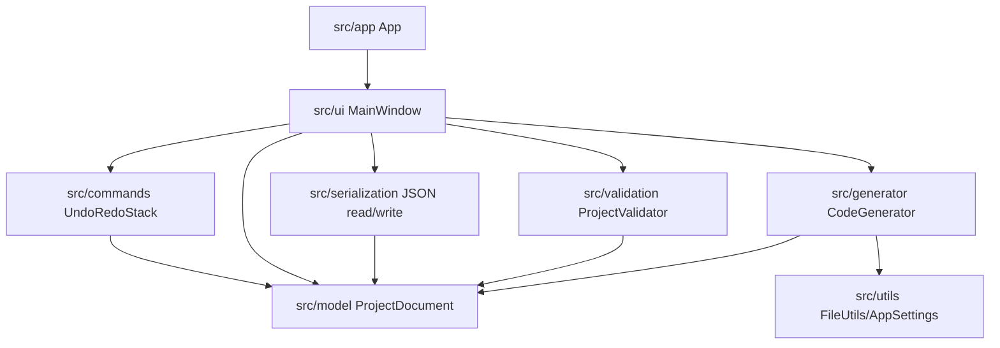

# VisiForm Project Specification

## 1. Document status

This document is the authoritative technical and product specification for the VisiForm repository. It is intended for developers, reviewers, automated coding agents, and future maintainers who need one durable reference for product scope, architecture, persistence, generation, validation, and development workflow.

Last updated: 2026-06-15.

Repository state when written:

- Branch: `main`
- Recent commit evidence: `6f95b09 Add BoxSizer layout system with enhanced features`
- Worktree status at setup time: `main...origin/main [ahead 1]` with active Phase 86 layout changes and untracked multi-agent setup prompts.
- Version evidence: `CMakeLists.txt` declares `project(VisiForm VERSION 1.0.0)`, and `src/app/Version.h` declares `VersionString = "1.0.0"`.

Terminology used in this document:

- **Implemented** means source code and documentation indicate the behavior exists.
- **Partial** means some code or docs exist, but documented gaps remain.
- **Planned** means phase plans or docs discuss future work, but the current source should not be treated as complete.
- **Proposed policy** means this document recommends a policy that the repository has not fully established.
- **Unknown** means repository evidence was insufficient.

## 2. Product definition

VisiForm is a C++20 desktop visual form builder based on the Visage UI and graphics library. It lets a developer construct a Visage interface visually, persist the design as a `.vfb.json` project file, validate the project model, and export a generated Visage-based C++ project.

The problem VisiForm solves is repetitive hand-authoring of Visage UI boilerplate. It gives C++ developers an editor workflow similar in spirit to `wxFormBuilder` and a generated-code/user-code separation reminiscent of tools such as Projucer, while remaining specific to Visage and this repository's CMake/vcpkg conventions.

Intended users:

- C++ developers building Visage desktop applications.
- Developers who want deterministic generated C++ scaffolding while keeping hand-written behavior in a user subclass.
- Maintainers and agents evolving widget, validation, persistence, and generator behavior.

Design philosophy:

- Keep model, serialization, validation, and generator code independent of Visage UI headers.
- Keep editor UI behavior in `src/ui/`.
- Preserve generated user-authored code where supported.
- Prefer deterministic, inspectable generated output over opaque runtime magic.
- Make behavior testable in model, serialization, validation, and generator layers where possible.

Primary supported platform: Windows 10/11 with Visual Studio 2022.

Experimental platforms: macOS and Linux have contributor-oriented documentation and generic Ninja presets, but repository docs explicitly avoid claiming full production support there.

## 3. Product goals

Current product goals are:

- Visual construction of Visage interfaces through a designer canvas, widget palette, property inspector, project tree, menus, and dialogs.
- Persistent project files using the `.vfb.json` extension.
- A validated in-memory project model before export.
- Deterministic C++ project generation for standalone Visage applications.
- Separation of generated base code from user-authored subclass code.
- Safe regeneration that preserves recognized `USER CODE` handler blocks.
- Maintainable layer boundaries across UI, model, serialization, validation, generator, commands, and utilities.
- Focused automated tests for model and JSON behavior, with additional validation and generator testing still needed.

## 4. Non-goals

Implemented non-goals and limitations documented by the repository:

- VisiForm is not a full retained-mode widget framework; generated runtime support is intentionally lightweight.
- Generated projects are not compiled into the main `VisiForm` target.
- Automated agents must not launch `VisiForm.exe` or generated apps.
- The current project does not promise full macOS or Linux runtime support.
- Runtime plugin loading for widgets is not implemented.
- External JSON widget-definition files are not implemented.
- A full visual event editor is not implemented.
- Full text editing support in generated `TextBox` widgets, including selection, clipboard, and IME behavior, is not implemented.
- Full generated layout manager parity for all dock/anchor behavior is partial.
- Runtime theme switching is not implemented.

Proposed non-goals:

- VisiForm should not become a general-purpose IDE or source editor.
- VisiForm should not silently overwrite arbitrary user files during export.
- VisiForm should not make generated-project build success a prerequisite for editing or saving `.vfb.json` projects.

## 5. Supported platforms and toolchain

Verified repository requirements and evidence:

- C++20 is required by `CMakeLists.txt` through `CMAKE_CXX_STANDARD 20`.
- CMake minimum is `3.24`.
- Main executable target is `VisiForm`.
- Windows presets use Ninja, vcpkg, `x64-windows-static`, and static MSVC runtime settings in `CMakePresets.json`.
- Dependencies in `vcpkg.json`: `nlohmann-json`, `fmt`, `spdlog`, and `catch2`.
- Visual Studio 2022 is the primary Windows IDE according to `README.md`, `AGENTS.md`, and `.github` instructions.
- `VISIFORM_VISAGE_SOURCE_DIR` can point to a local Visage checkout.
- If no local Visage checkout is found, CMake falls back to `FetchContent` with `VISIFORM_VISAGE_GIT_REPOSITORY` and `VISIFORM_VISAGE_GIT_TAG`.
- `VISIFORM_VISAGE_GIT_TAG` currently defaults to `main`, with a TODO in `CMakeLists.txt` to replace it with a tested commit hash.

Supported and experimental status:

- Windows 10/11: primary supported development and validation path.
- macOS: experimental contributor path; additional native dialog and platform work may be needed.
- Linux: experimental contributor path; Visage platform support and native dialog work may be needed.

Agents must not run build scripts, generated build scripts, terminal build commands, PowerShell build commands, or `cmd.exe` build commands unless the developer explicitly asks for that exact command.

## 6. System architecture

Major repository layers:

- Application shell: `src/app/App.cpp`, `src/app/Startup.cpp`, `src/app/main.cpp`, `src/app/Version.h`.
- UI/editor layer: `src/ui/MainWindow.*`, `src/ui/DesignerCanvas.*`, `src/ui/PropertyInspector.*`, `src/ui/WidgetPalette.*`, `src/ui/ProjectTree.*`, `src/ui/editors/*`, `src/ui/resources/*`.
- Model layer: `src/model/ProjectDocument.*`, `src/model/WidgetNode.*`, `src/model/WidgetRegistry.*`, `src/model/WidgetDefinition.*`, `src/model/LayoutEngine.*`, `src/model/BoxSizerLayout.*`, `src/model/ProjectResource.*`, `src/model/LookAndFeelRegistry.*`, `src/model/WidgetItemUtils.*`, `src/model/PropertyValue.*`.
- Serialization: `src/serialization/JsonProjectReader.*`, `src/serialization/JsonProjectWriter.*`.
- Validation: `src/validation/ProjectValidator.*`.
- Generator: `src/generator/CodeGenerator.*`, `src/generator/VisageCppEmitter.*`, `src/generator/CMakeEmitter.*`.
- Commands: `src/commands/Command.*`, `src/commands/UndoRedoStack.*`, `src/commands/CommandRegistry.*`.
- Utilities: `src/utils/*`.
- Tests: `tests/CMakeLists.txt`, `tests/test_project_serialization.cpp`, `tests/test_box_sizer_layout.cpp`.
- Documentation: `docs/` and `docs/agent_plans/`.



Dependency boundary:

- `src/ui/` may depend on Visage headers.
- `src/model/`, `src/serialization/`, `src/validation/`, and `src/generator/` should not depend on Visage UI headers.
- Generated projects are separate outputs and must not be linked into the main `VisiForm` target.

## 7. Project model specification

The root model type is `visiform::model::ProjectDocument` in `src/model/ProjectDocument.h`.

Document-level fields include:

- `schemaVersion`
- `projectName`
- `executableName`
- `mainFormClassName`
- `generatedBaseClassName`
- `userSubclassName`
- `windowTitle`
- `lookAndFeelId`
- `resources`
- `root`
- `selectedWidgetId`
- runtime-only `dirty`

Widgets are stored as `visiform::model::WidgetNode` in `src/model/WidgetNode.h`. Each node has:

- `id`
- `name`
- `type`
- parent-relative `bounds`
- `parentId`
- `zOrder`
- map-based `properties`
- nested `children`

Supported `WidgetType` values currently include `FormWindow`, `Frame`, `GroupBox`, `Panel`, `Sizer`, `TabControl`, `TabPage`, `MenuBar`, `ToolBar`, `Label`, `Button`, `TextBox`, `ComboBox`, `ListBox`, `TableGrid`, `TreeView`, `CheckBox`, `RadioButton`, `Slider`, `ScrollBar`, `StatusBar`, `ProgressBar`, `ModalDialog`, `ColorPicker`, `Image`, and `Spacer`.

Identity and naming:

- `id` is the stable model identifier and must be unique.
- `name` is editor-facing and generator-facing; duplicate names are allowed but validation warns because lookup by name becomes ambiguous.
- `userSubclassName` must be a valid C++ identifier and must not be `MainWindow`.
- Generated base class name remains `MainWindow`.

Ownership:

- The root widget is the `FormWindow`.
- Hierarchy is represented by nested `children`.
- `parentId` and `zOrder` mirror the nested hierarchy.
- `ProjectDocument::refreshHierarchyMetadata()` normalizes parent and z-order metadata.
- `WidgetRegistry::canContainChild(...)` governs parent-child compatibility.

Mutation rules:

- UI-level mutations should go through `MainWindow` command helpers and `UndoRedoStack` where supported.
- `DocumentStateCommand` stores whole-document before/after states for complex changes.
- `ProjectDocument` owns lower-level helpers such as selection, reparenting, duplication, resource lookup, and layout refresh.

Incomplete areas:

- General-purpose parenting UI is still partial. Docs identify `GroupBox`, root form, selected `TabPage`, and `Sizer` workflows as current focus areas.
- Full generated layout support for all hierarchy and anchor cases is partial.

## 8. Layout and sizer specification

Current layout systems include:

- Parent-relative absolute bounds on widgets.
- Dock and anchor metadata.
- Parent-relative layout for root form, `GroupBox`, `TabPage`, and `Sizer` contexts.
- BoxSizer-style layout through the `Sizer` widget and `BoxSizerLayout` helpers.

BoxSizer evidence:

- Types and helpers live in `src/model/BoxSizerLayout.h` and `.cpp`.
- Shared editor/model layout entry points include `calculateBoxSizerMinimumSize(...)` and `layoutBoxSizerChildren(...)`.
- `LayoutEngine` integrates layout behavior.
- Tests live in `tests/test_box_sizer_layout.cpp`.
- Active Phase 86 plan: `docs/agent_plans/phase_86_box_sizer_layout_system_plan.md`.

Sizer metadata:

- Sizer properties: `orientation`, legacy `padding`, `paddingLeft`, `paddingTop`, `paddingRight`, `paddingBottom`, `gap`.
- Direct child properties: `sizerItem.proportion`, `sizerItem.expand`, `sizerItem.alignment`, `sizerItem.border`, `sizerItem.borderSides`, `sizerItem.preferredWidth`, `sizerItem.preferredHeight`, `sizerItem.minimumWidth`, `sizerItem.minimumHeight`, `sizerItem.shown`.
- Spacer properties: `spacer.kind` and `spacer.size`.

Implemented behavior indicated by docs and tests:

- Vertical and horizontal orientation.
- Padding and gap.
- Proportional main-axis distribution.
- Cross-axis expansion and alignment.
- Item borders and selected border sides.
- Minimum size overrides.
- Fixed and stretch spacers.
- Nested sizers through recursive layout.
- Legacy uniform `padding` migration to side padding on load.
- Generated runtime metadata and layout support for sizers.

Current Phase 86 gaps:

- True dashed design-time sizer outline is still listed as a TODO.
- Explicit insertion/reorder feedback between sizer children is still listed as a TODO.
- Validation, generator-inspection, undo/redo, and full acceptance-scenario tests remain listed as TODOs.

## 9. VisiForm project file format

Project files use the `.vfb.json` extension. `ProjectDocument::projectFileExtension()` returns `.vfb.json`; `JsonProjectWriter::writeToFile(...)` rejects paths without that extension.

Current schema version: `1`.

Top-level fields:

- `schemaVersion`
- `projectName`
- `executableName`
- `mainFormClassName`
- `generatedBaseClassName`
- `userSubclassName`
- `windowTitle`
- `lookAndFeelId`
- `selectedWidgetId`
- `resources`
- `root`

Required on read:

- `schemaVersion`
- `projectName`
- `mainFormClassName`
- `root`, unless legacy `widgets` are present

Optional/compatibility fields:

- `executableName`, `generatedBaseClassName`, `userSubclassName`, `windowTitle`, `lookAndFeelId`, `resources`, `selectedWidgetId`, `widgets`.
- Legacy top-level `widgets` are attached to the root form during load.

Property value types:

- `null`
- boolean
- integer
- float
- string

Objects and arrays are not generic property values. Special cases:

- `items` arrays are accepted for supported item-list widgets and normalized to newline-delimited model text.
- `itemActions` arrays are accepted for supported action-list widgets and normalized similarly.

Malformed input:

- Invalid JSON returns an error from `JsonProjectReader::readFromString(...)`.
- Unknown `schemaVersion` is rejected.
- Unsupported widget types are rejected.
- Missing required fields are rejected.
- Invalid property value types are rejected.
- Invalid bounds are rejected.

Unknown top-level fields are not preserved by the writer. Unknown widget properties with supported scalar values are preserved through `properties`.

Representative project:

```json
{
  "schemaVersion": 1,
  "projectName": "ExampleProject",
  "executableName": "ExampleProject",
  "mainFormClassName": "AppMainWindow",
  "generatedBaseClassName": "MainWindow",
  "userSubclassName": "AppMainWindow",
  "windowTitle": "Example Project",
  "lookAndFeelId": "VisiFormDark",
  "selectedWidgetId": "button_hello",
  "resources": [],
  "root": {
    "id": "form_main",
    "name": "MainWindow",
    "type": "FormWindow",
    "bounds": { "x": 0, "y": 0, "width": 900, "height": 600 },
    "parentId": "",
    "zOrder": 0,
    "properties": {
      "title": "Example Project",
      "backgroundColor": "#202026"
    },
    "children": [
      {
        "id": "button_hello",
        "name": "helloButton",
        "type": "Button",
        "bounds": { "x": 40, "y": 40, "width": 180, "height": 46 },
        "parentId": "form_main",
        "zOrder": 0,
        "properties": {
          "text": "Click Me",
          "onClick": "handleClick"
        },
        "children": []
      }
    ]
  }
}
```

Versioning strategy:

- Current schema remains `1`.
- Proposed policy: future schema migrations should occur in `src/serialization/`, preserving compatibility for older files where feasible.

## 10. Validation specification

Validation is implemented in `src/validation/ProjectValidator.*`.

Validation result types:

- `ValidationSeverity::Info`
- `ValidationSeverity::Warning`
- `ValidationSeverity::Error`
- `ValidationReport`
- `ValidationMessage`

Validation runs:

- On demand from toolbar/menu validation flows.
- Before export.
- Reports are written to `Generated/validation_report.md` by `MainWindow`.
- Errors block export.
- Warnings do not block export.

Validation categories include:

- Project naming and generated source naming.
- `userSubclassName` C++ identifier and reserved-name checks.
- Local Visage dependency settings.
- Look-and-feel id checks.
- Resource id, source path, and export path checks.
- Duplicate widget ids and duplicate widget names.
- Parent-child hierarchy, parent id, cycles, and container rules.
- Bounds and status-bar overlap warnings.
- Color, dock, anchor, layout mode, range, style, and enum validation.
- Sizer, sizer-item, and spacer validation.
- Item-list, item-action, table-grid, tree-view, image, color-picker, and radio-group validation.
- Callback C++ identifier checks and incompatible signature reuse.

Validation gaps:

- Phase 86 still lists validation tests as needed.
- Full generated-project compile validation is manual or developer-driven under repository safety rules.

## 11. Designer behavior

Primary designer behavior is coordinated by `src/ui/MainWindow.*` and rendered by `src/ui/DesignerCanvas.*`.

Implemented editor features include:

- Widget creation from palette and Insert menu.
- Root form, `GroupBox`, selected `TabPage`, and `Sizer` insertion contexts according to current docs.
- Selection and multi-selection.
- Marquee selection.
- Primary and secondary selection visuals.
- Move, resize, nudge, align, center, distribute, bring forward, send backward, copy, paste, duplicate, and delete workflows.
- Grid, snap, and smart guide behavior.
- Project tree hierarchy navigation.
- Property inspector updates for selected widgets, including a fixed tab strip with separate `Properties` and `Events` views.
- A reusable splitter-based shell boundary between the Designer Canvas and Property Inspector, with persisted inspector width.
- Modal editor dialogs for project settings, resources, keyboard shortcuts, item lists, table grids, and tree nodes.
- Resource preview for images through `ImageResourceCache`.
- Validation modal summary display.

Reparenting:

- `GroupBox` and root workflows are documented.
- `TabControl`/`TabPage` insertion and selection are documented.
- `Sizer` snap-connect and sizer child behavior are active Phase 86 areas.
- General reparenting for every container-capable widget is partial.

Undo/redo:

- `UndoRedoStack` and command classes are implemented.
- Whole-document commands support complex changes.
- Some operations may still use direct edits; docs and phase plans identify gaps for broader undo/redo tests.

Error handling:

- User-facing failures generally update status text or show editor modals.
- File and generator failures return error messages.

## 12. Property system

Properties are stored in `WidgetNode::properties` as `std::map<std::string, PropertyValue>`.

`PropertyValue` supports:

- empty/null
- boolean
- integer
- float
- string

Property definitions live in `WidgetDefinition` and `WidgetRegistry`.

Editor controls in `PropertyInspector` include:

- fixed `Properties` and `Events` tabs
- text
- integer
- float
- slider
- color
- choice/dropdown
- bool
- read-only rows
- compact event rows with `Create`, `Existing`, and `Clear` assignment controls

Property behavior:

- Defaults are created through `WidgetRegistry::createDefaultWidget(...)`.
- Persistence is handled by `JsonProjectReader` and `JsonProjectWriter`.
- Validation is handled by `ProjectValidator`.
- Generated output mapping is handled by `VisageCppEmitter` and `CMakeEmitter`.
- UI edits are routed through `MainWindow` property setters and command wrappers where supported.

Special property groups:

- Style overrides: `lookAndFeelId`, `fillColor`, `textColor`, `borderColor`, `accentColor`, `borderThickness`, `cornerRadius`, `fontSize`.
- Events: widget event keys such as `onClick`, `onChanged`, `onTextChanged`, `onAccepted`, `onCancelled`. Supported event rows are shown on the dedicated `Events` inspector tab, while non-event properties remain on the `Properties` tab. Event rows assign handlers through explicit `Create`, `Existing`, and `Clear` controls; `Existing` is limited to signature-compatible handlers and row-local validation is shown beneath affected rows.
- Item lists: `items`, selected index keys, and optional `itemActions`.
- Tree nodes: `nodes`, `selectedNodePath`, `expandedNodePaths`.
- Layout: `dock`, `anchor`, `layoutMode`, `tabIndex`, sizer metadata.

Incomplete areas:

- No external property schema file.
- No full event-flow designer beyond compact event assignment rows.
- No theme editor UI.

## 13. Code-generation specification

Code generation is implemented through:

- `src/generator/CodeGenerator.*`
- `src/generator/VisageCppEmitter.*`
- `src/generator/CMakeEmitter.*`

Default export fallback path:

- `Generated/ExportedVisageProject`

Generated files include:

- `CMakeLists.txt`
- `CMakePresets.json`
- `README.md`
- `.gitignore`
- `scripts/configure_static_debug.cmd`
- `scripts/build_static_debug.cmd`
- `scripts/configure_static_release.cmd`
- `scripts/build_static_release.cmd`
- `scripts/configure_static_debug.ps1`
- `scripts/build_static_debug.ps1`
- `scripts/configure_static_release.ps1`
- `scripts/build_static_release.ps1`
- `src/main.cpp`
- `src/MainWindow.h`
- `src/MainWindow.cpp`
- `src/<UserSubclassName>.h`
- `src/<UserSubclassName>.cpp`
- managed assets under `assets/` when resources exist

Generated CMake behavior:

- CMake 3.24 minimum.
- C++20.
- Static MSVC runtime settings on Windows.
- Local Visage source discovery through `VISIFORM_VISAGE_SOURCE_DIR`.
- Environment and nearby sibling Visage checkout discovery.
- FetchContent fallback.

Export safety:

- `CodeGenerator::writeGeneratedFile(...)` rejects absolute relative paths and refuses writes outside the export directory.
- Managed resources must copy under `assets/`.
- Unknown user files are not intentionally deleted.

Generated runtime:

- Uses a lightweight runtime widget model.
- Supports concrete output for many widgets.
- Preserves hierarchy metadata, selected-tab data, BoxSizer metadata, and preferred sizes.
- Generated interaction is partial and intentionally not a complete UI framework.

Error behavior:

- Generation returns `false` and fills `errorMessage` when file writes, source emission, resource copy, or path safety checks fail.

## 14. USER CODE preservation contract

Exact marker format:

- `// USER CODE BEGIN handlerName`
- `// USER CODE END handlerName`

Implemented extraction evidence is in `VisageCppEmitter.cpp`, where the emitter searches existing generated user subclass source for begin and end markers keyed by handler name.

Preservation behavior:

- Existing user subclass `.cpp` is read from `src/<UserSubclassName>.cpp`.
- Recognized handler bodies are extracted by handler name.
- Re-emitted handlers restore preserved body text when the handler still exists.
- New handlers receive default TODO/example content.

Limitations:

- Preservation is handler-name based.
- Orphaned code for handlers no longer referenced by the project is not automatically preserved.
- Duplicate marker behavior is not fully specified by tests; current extraction uses map insertion by handler name, so later duplicate handling should be treated as unspecified.
- Missing end markers are ignored by the extraction loop rather than treated as recoverable blocks.

Expected tests:

- USER CODE preservation round-trip tests are required but not currently represented in `tests/`.
- Generator source-inspection tests are listed as a Phase 86 gap.

## 15. Build specification

Repository build evidence:

- Root `CMakeLists.txt` creates target `VisiForm`.
- On Windows, `CMakeLists.txt` sets `WIN32_EXECUTABLE TRUE` for `VisiForm` and adds `resources/windows/VisiForm.rc`.
- Tests are optional behind `VISIFORM_BUILD_TESTS`.
- `tests/CMakeLists.txt` creates `VisiFormTests`.
- `CMakePresets.json` defines `vs2022-x64-static-debug`, `vs2022-x64-static-release`, `ninja-debug`, and `ninja-release`.
- Build presets are `build-static-debug`, `build-static-release`, `build-ninja-debug`, and `build-ninja-release`.
- Test preset: `test-static-debug`.
- Scripts exist in `scripts/`, but agents must not run them unless explicitly asked.

Documented Windows workflows:

- Open repository folder in Visual Studio 2022 and build the `VisiForm` target.
- Use x64 Native Tools Command Prompt for command-line preset workflows.
- Normal PowerShell may fail if the MSVC compiler environment is not loaded.
- The normal Windows `VisiForm` build is intended to launch without a console window.

Generated project workflows:

- Open exported project folder in Visual Studio 2022.
- Use generated CMake presets.
- Use generated helper scripts where appropriate.

Agent validation rule:

- Preferred validation is the Visual Studio workspace build pipeline for the main `VisiForm` target when available and unambiguous.
- If unavailable or ambiguous, defer build validation to the developer.

## 16. Testing strategy

Existing tests:

- `tests/test_project_serialization.cpp`
- `tests/test_box_sizer_layout.cpp`
- `tests/CMakeLists.txt`

Covered categories:

- Default project creation.
- JSON round-trip.
- Invalid JSON.
- Invalid widget type.
- BoxSizer padding, gap, proportions, borders, alignment, minimum sizes, relayout, and legacy padding migration.

Needed test categories:

- Validation unit tests.
- Generator source-inspection or golden-output tests.
- USER CODE preservation tests.
- Resource export path tests.
- Property conversion tests.
- Designer interaction tests where feasible without launching the app.
- Undo/redo tests for complex document changes.
- Generated-project build tests, performed through approved/manual workflows.
- Regression tests for active Phase 86 behavior.

Known gap:

- The current test target does not cover all model/generator/validation files needed for broad tests.

## 17. Error handling and diagnostics

Current error surfaces:

- `JsonProjectReader` returns `std::nullopt` and an error string for malformed JSON and invalid schema/model fields.
- `JsonProjectWriter::writeToFile(...)` returns `false` and an error string for invalid file extensions or write failures.
- `ProjectValidator` returns structured messages with severity, code, message, widget id, and property key.
- `CodeGenerator` returns `false` and an error string on generation failure.
- `MainWindow` reports status messages and modal summaries for validation and editor workflows.
- `FileUtils` is used for text file I/O, directory creation, copy, path checks, and path normalization.
- `src/app/Startup.cpp` owns fatal application-startup reporting and routes diagnostics to `OutputDebugStringW` plus a native Windows error dialog on Windows, and `std::cerr` on non-Windows builds.

Build errors:

- Build errors are not handled inside the editor except through generated documentation and scripts.
- Agents must not run builds unless explicitly authorized by exact command.

Debug logging:

- `spdlog` is a dependency, but the primary app shell currently relies on lightweight startup/debug output rather than a repository-wide structured logging policy.

## 18. Compatibility policy

Implemented compatibility:

- `.vfb.json` schema version is `1`.
- Legacy top-level `widgets` arrays can be loaded and attached to the root.
- Missing generated naming fields receive compatibility fallbacks.
- Missing `resources` defaults to an empty list.
- Unknown scalar widget properties are preserved.
- Legacy `Sizer.padding` migrates to side padding when side padding is absent.
- Older item-list storage is normalized by helper functions.

Proposed policy:

- New `.vfb.json` fields should be additive when possible.
- Schema version should change only when old readers cannot safely interpret new files.
- Reader migrations should live in `src/serialization/` or model normalization helpers.
- Generated source compatibility should preserve `MainWindow` base naming and user subclass preservation markers across releases.
- Experimental macOS/Linux support should remain documented as contributor-oriented until validated.
- FetchContent should eventually pin Visage to a tested commit for reproducible remote builds.

## 19. Security and data integrity

Implemented safeguards:

- Project file writes require `.vfb.json`.
- Generated file writes are constrained inside the selected export folder.
- Resource export paths must remain under `assets/`.
- Unknown user files are not intentionally deleted during export.
- `USER CODE` markers preserve recognized user-authored handler content.
- Validation blocks export on errors.

Trust boundaries:

- `.vfb.json` input is untrusted JSON and is parsed defensively.
- Resource source paths are local file paths and are validated before export.
- Generated helper scripts execute build tools and should be run only by developers in trusted contexts.
- Automated agents must not launch generated apps or `VisiForm.exe`.

Proposed policy:

- Keep generated-file ownership explicit and documented.
- Add tests for export path traversal and preservation behavior.
- Avoid embedding machine-specific paths in committed examples.

## 20. Development workflow

Repository workflow is phase-based.

Rules from `AGENTS.md` and `.github` instructions:

- Multi-step agent work creates or updates a persistent phase plan under `docs/agent_plans/`.
- Phase plan filenames should follow `phase_N_<name>_plan.md`.
- Plans include a checklist.
- Plans are updated as work progresses.
- Build validation status is recorded before finishing.
- Final result summaries and remaining TODOs are written into the plan.
- Agents must preserve user changes and avoid reverting unrelated work.
- Product behavior changes must update relevant docs.
- Build validation uses Visual Studio workspace pipeline when available and unambiguous; otherwise defer to developer.
- When modifying an editor UI region, prefer using or improving a reusable VisiForm widget instead of adding new one-off editor-only layout code.

Multi-agent workflow:

- `session-instructions/agents instructions/` contains setup prompts for a structured multi-agent Codex workflow.
- Current `.codex/agents/` defines six custom agents: `visiform_explorer`,
  `visiform_architect`, `visiform_implementer`, `visiform_validator`,
  `visiform_reviewer`, and `visiform_documenter`.
- Lead-agent responsibilities should include assigning bounded tasks, preserving active phase work, enforcing AGENTS rules, and reconciling docs/spec updates.

## 21. Release readiness criteria

Before a release, the repository should have:

- A clean supported Windows Visual Studio 2022 build of the `VisiForm` target.
- Automated tests configured and passing where applicable.
- Generated-project export inspected and, where feasible, built through approved/manual workflows.
- `VisiForm.exe` and generated apps not launched by agents.
- Documentation updated for user-facing and generator behavior.
- `CMakeLists.txt`, `src/app/Version.h`, README, and generated source comments consistent for version bumps.
- Compatibility review for `.vfb.json` schema and generated source preservation.
- Known issues documented.
- Git status clean or intentional changes recorded.
- No accidental edits to `build/`, `out/`, `.vs/`, `Generated/`, or local-only files.

## 22. Current implementation status

| Subsystem | Status | Evidence | Active phase | Known gaps |
| --- | --- | --- | --- | --- |
| Application shell | Implemented | `src/app/App.*`, `src/app/Startup.cpp`, `src/app/main.cpp`, `src/app/Version.h` | None | Command-line handling remains minimal |
| Main target build wiring | Implemented | `CMakeLists.txt`, `CMakePresets.json`, `resources/windows/VisiForm.rc` | None | Visage tag still defaults to `main` |
| Project model | Implemented | `ProjectDocument`, `WidgetNode`, `WidgetRegistry` | Phase 86 touches layout | More tests needed |
| JSON persistence | Implemented | `JsonProjectReader`, `JsonProjectWriter`, serialization tests | None | Unknown top-level fields not preserved |
| Validation | Partial | `ProjectValidator`, docs | Phase 86 gaps | Validation tests needed |
| Designer canvas | Partial | `DesignerCanvas`, `MainWindow`, docs | Phase 86 | Some sizer feedback TODOs |
| Property inspector | Implemented/Partial | `PropertyInspector`, docs | Phase 86 touched | No full event editor/theme editor |
| Command/undo | Partial | `Command`, `UndoRedoStack`, `DocumentStateCommand` | Phase 86 | More undo tests needed |
| Resources | Implemented/Partial | `ProjectResource`, resource docs, Windows app icon resources | None | Runtime asset loading partial |
| Code generation | Partial | `CodeGenerator`, `VisageCppEmitter`, `CMakeEmitter` | Phase 86 | Generator tests and full runtime parity gaps |
| USER CODE preservation | Partial | `VisageCppEmitter` marker extraction | None | Dedicated tests needed |
| BoxSizer | Partial/Implemented core | `BoxSizerLayout`, tests, Phase 86 plan | Phase 86 | Designer outline/reorder/tests TODOs |
| Tests | Partial | `tests/` | Phase 86 | Validation/generator/designer tests missing |
| Multi-agent workflow | Implemented setup | `.codex/config.toml`, `.codex/agents/`, `AGENTS.md`, session instructions | Setup | Operational subagent smoke-test depends on Codex runtime availability |

## 23. Open design decisions

- Should `VISIFORM_VISAGE_GIT_TAG` be pinned to a tested commit, and when?
- What exact compatibility promise should be made for future `.vfb.json` schema versions?
- Should unknown top-level JSON fields be preserved, ignored, or rejected?
- What is the canonical generated-output golden-test strategy?
- How should duplicate or malformed `USER CODE` markers be handled?
- What level of generated runtime layout parity is required for dock/anchor versus sizer behavior?
- Which designer interactions can be tested without launching `VisiForm.exe`?
- Should widget definitions eventually move to external data, or remain built into `WidgetRegistry`?
- How should `.codex/agents/` files be named, versioned, and assigned to subagents?

## 24. Glossary

- **VisiForm**: The C++20/Visage form builder in this repository.
- **Visage**: The UI and graphics library used by VisiForm and generated projects.
- **ProjectDocument**: The root in-memory project model.
- **WidgetNode**: A node in the form/component tree.
- **FormWindow**: The root form widget.
- **WidgetRegistry**: Built-in registry of widget metadata, defaults, palette visibility, properties, and events.
- **PropertyValue**: Variant-like storage for scalar widget property values.
- **Property Inspector**: UI panel for editing selected widget/project settings.
- **Designer Canvas**: UI surface that previews and manipulates the form.
- **Project Tree**: Hierarchical view of the root and widget children.
- **Command**: Undoable operation in `src/commands/`.
- **DocumentStateCommand**: Whole-document undo/redo command used for complex edits.
- **`.vfb.json`**: VisiForm project file format.
- **Generated base class**: The generated `MainWindow` class in exported projects.
- **User subclass**: The generated user-edit layer such as `AppMainWindow`.
- **USER CODE region**: Marker-delimited handler body preserved across regeneration.
- **BoxSizer**: Sizer-style layout manager for horizontal or vertical child layout.
- **Sizer item**: Per-child layout metadata interpreted when the direct parent is a `Sizer`.
- **Spacer**: Layout item used for fixed or stretch empty space inside a sizer.
- **Dock**: Metadata for parent-relative edge/fill layout.
- **Anchor**: Metadata for resize/reposition behavior.
- **Look and feel**: Built-in registry preset plus per-widget style overrides. One shared registry resolver supplies application/control/recessed/raised surfaces, text roles, state colors, bevel edges, and metrics to Design Mode, Preview Mode, and generated output; project files continue to store only `lookAndFeelId`.
- **Generated project**: Standalone C++/CMake project emitted by VisiForm export.
